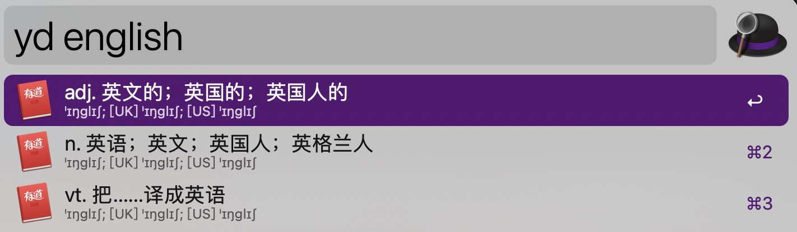

# Enlgish Studying

> 螾无爪牙之利，筋骨之强，上食埃土，下饮黄泉，用心一也。
> 蟹六跪而二螯，非蛇蟺之穴无可寄托者，用心躁也。

在学习之前、 在浮躁的时候， 看看 [荀子《劝学》](https://www.bilibili.com/video/BV1aP411W7Dq/)。 **慢就是快，少就是多； 日积月累，逐渐成神**。

## 1. 开始之前

### 1.1. 关于英语教材、 培训机构的选择

我个人推荐一定要有 **等级/阶段** 划分的英语教材或者培训机构。 个人比较反感那些 **30天**、 **一本书** 等这一类书。 
所有东西的发展规律都是循序渐进的， 可以类比一下其他事情。 如果其他事情都不行， 为什么 **英语学习** 就可以了呢？

因此 **符合当前阶段的才是最好的**， 每个阶段 **稳扎稳打** 最有效。

### 1.2. 关于 **等级/阶段** 选择

不论我多少岁去驾校学开车， 教练都是从挂档起步开始教学。 而不是说 20 岁是平地起步开始， 而 30 岁就从坡道起步开始。

选择 **分级学习** 也是同样道理

> **核心要点** 是 **我们当前是什么等级就选什么书**， 而不是 **我什么年龄选什么书**。 
>> 扩展一下， 在辅导孩子的时候也可以套用一下这个思维。 六年级的内容不懂， 是不是因为四年级的内容没掌握好？

另外对于 **外语** 而言， 通常缺少语言环境。 因此可能 **读写等级** 和 **听说等级** 是不一样的， 在选择等级教材的时候也要各自有所针对。

### 1.3. **等级/阶段** 测试

不同的测试平台、工具的测试内容和结果可能不一致。 如果有这种情况

1. 可以测试几个平台对比一样， 然后选择一个 **自己认可** 的等级开始学。
2. 可以 **选定** 某个平台， 任何改平台的结果， 然后跟着这个平台的阶段课程学习。

这里提供两个我自己用的

1. [英孚英语水平测试 - EF](https://www.efset.org/zh/) 在线平台
2. [**英语流利说**](https://www.liulishuo.com/) App

## 2. 学习资源

## 2.1. 核心基础

在单词上， 我比较推荐 **音标为主**， **自然拼读辅助** 的学习方式。

> 个人意见， 仅供参考

1. 从数量上： 音标音素 **48个**， 而自然拼读音素有 **150个** 左右 [大猫自拼系列的作者带两个孩子，示范怎样在家带娃学自然拼读](https://www.bilibili.com/video/BV1uh4y1v7n9/)。  
    1. 英语中有大量的外来词， 并不遵循自然拼读规则。 比如最常见的 `朋友 friend /frend/`， 这里的 `i` 并不发音， 按照自然拼读规则就是 `/friːnd/`， 参考 `piece`。
    2. 英语不是日常用于， 没有大量 **主动/被动输入**。 有意识的单次输入， 很少会有和其他信息的关联。 如果这点比理解， 可以回想对比一下不认识的中文字， 就很好理解了。
2. 从习惯上： **音标拼读** 和 **拼音拼读** 逻辑一样的。 在拼音罗马化之后， 我们在这方面有天然的优势。
3. 据说自然拼读规则能覆盖 **70% 以上** 的词， 所有配合音标学习、掌握还是很有必要的。

**单词**

1. [48英语英标 - B站英语兔](https://www.bilibili.com/video/BV1vi4y1C73C/)
2. [Nessy 自然拼读](https://www.bilibili.com/video/BV1SN411B7ok/)

**语法**

1. [英语语法精讲合集 (全面, 通俗, 有趣 | 从零打造系统语法体系) - B 站英语兔](https://www.bilibili.com/video/BV1XY411J7aG/)
2. [不规则动词](./english/irregular-verbs.md) 英语兔 整理。

## 2.2. 分级课程

前面已经说了， 适合自己的才是最重要的。

1. 启蒙课程： **RAZ、 牛津数、 红火箭** 等都是很好的阶段行课程， 适合小朋友。 跟着点读笔一起学习， 可能需要大人辅导。
2. 自学课程： B站 [**胶囊助学计划**](https://space.bilibili.com/1078480983) 有一个系列课程讲解 [《新概念英语》系列教材](./english/new-concept-english.md)
    1. [新概念英语（第一册）](https://www.bilibili.com/video/BV1xa411J7jJ/)
    1. [新概念英语（第二册）](https://www.bilibili.com/video/BV1XA4y1o72C/)
    1. [新概念英语（第三册）](https://www.bilibili.com/video/BV1zY4y187cK/)

## 2.3. 听力磨耳朵

1. [TED视频字幕下载](http://ted163.com/) 可以根据时常和标题选择难度。 另外还可以下载对应 PDF 文件进行 **精读学习**。 通过 MarginNote 做笔记。
2. [新概念英语（一册） - 网易云音乐](https://music.163.com/playlist?id=2396882979&userid=74572695) 没事就放着听。 多输入， 才有多输出。

## 2.4. 口语练习

1. [Susan精讲绘本 | 牛津树*学校版* 1阶](https://www.bilibili.com/video/BV1LJ411j741/), 家里有有小朋友的可以 **模仿** 这种讲解方式。 不同阶段可以使用 **不同复杂度** 的句子。
2. [AI 对话](https://app.myshell.ai/) 一款根据 ChatGPT 开发的 AI 对话软件。 可以进行口语练习、 纠正。
3. 其他 App 跟读

## 2.5. 工具书

1. [《英语阅读参考手册》（叶永昌）](./english/a-reference-for-english-reading.md) 一本很全的语法书， 当作字典用。

## 3. 常用工具

1. [**Alfred-有道词典** 扩展](https://github.com/tangx/alfred-youdao): 快速查词

2. [MarginNote](https://www.marginnote.com/) **收费**， [LiquidText](https://www.liquidtext.net/) **基础功能免费** ， 都是 PDF 阅读软件， 可以标注做笔记、写脑图。 

3. [ChatGPT](https://chat.openai.com/) 一个很好的英语辅导老师。 上图中的解释， 就是 ChatGPT 给的。 常用咨询语句如下
    1. 造句： `Create 10 sentences with first and foremost`
    2. 句子解释: `How to understand the following sentence: That top from that Instagram post that went to a charity shop instead of being reworn`

4. [hallelujah 输入法](https://github.com/dongyuwei/hallelujahIM) 英文拼写心里「没底」？这个输入法能把拼音补全为英文：哈利路亚输入法

