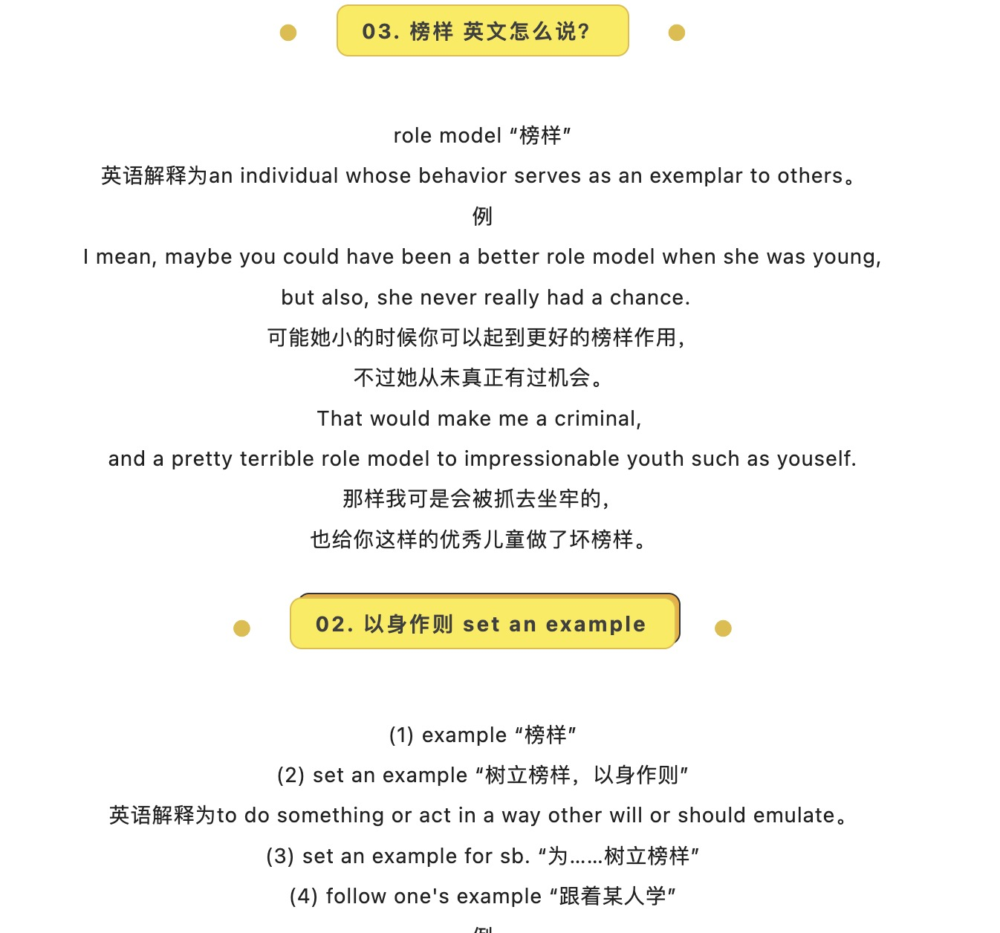

# 2023-12-26 以身作则

## Words

1. exemplar
2. role model
3. set an example

## Example

### 1. role model

> an individual whose behavior serves as an exemplar to others.

1. I mean, maybe you could have been a better `role model` when she was young, but also, she never really had a chance.

2. That would make me a criminal, and a `pretty terrible role model` to impressionable youth such as yourself.

### 2. set an example

1. example
2. set an example
3. set an example for sb
4. follow one's example

