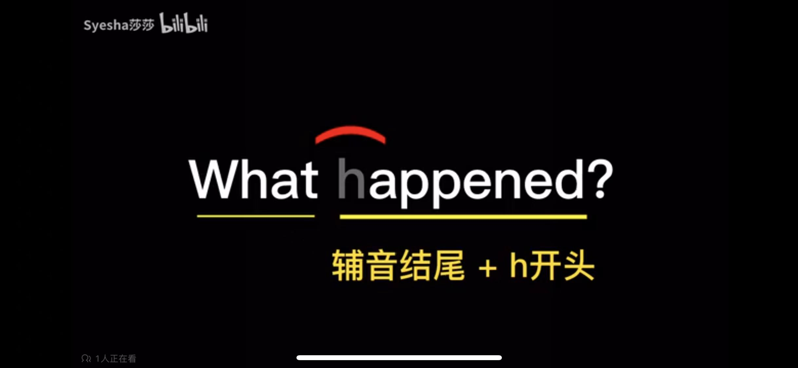
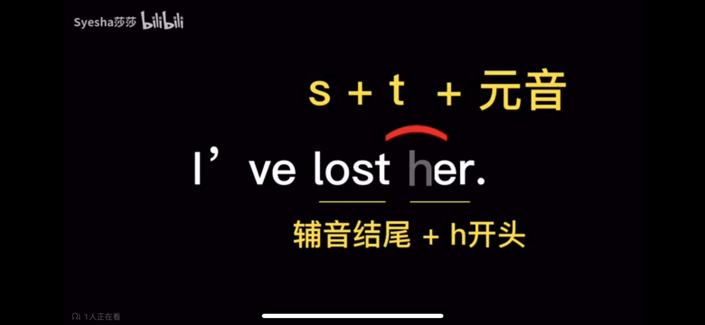

# t 的发音

## 1. flap-t

当 **/t/** 在两个原因中间的时候， 发 flap-t 的音， 有点像 **/d/**

1. wa`t`er
2. ci`t`y
3. pre`tt`y

4. Wha`t` happened?

关于 flap-t 发音时， 舌头变化视频： https://www.bilibili.com/video/BV13N4y1D7a7/

## 2. s`t` 浊化成 t

**/t/** 在 **/s/** 后， 且在 **同一个音节** 中， 才会被浊化成 **d**。

1. s`t`dent
2. s`t`upid

3. I've lost her! : 
    1. 这里 h 在不发音
    2. /ster/ 构成一个音节， t 在 s 后， 浊化成 d

